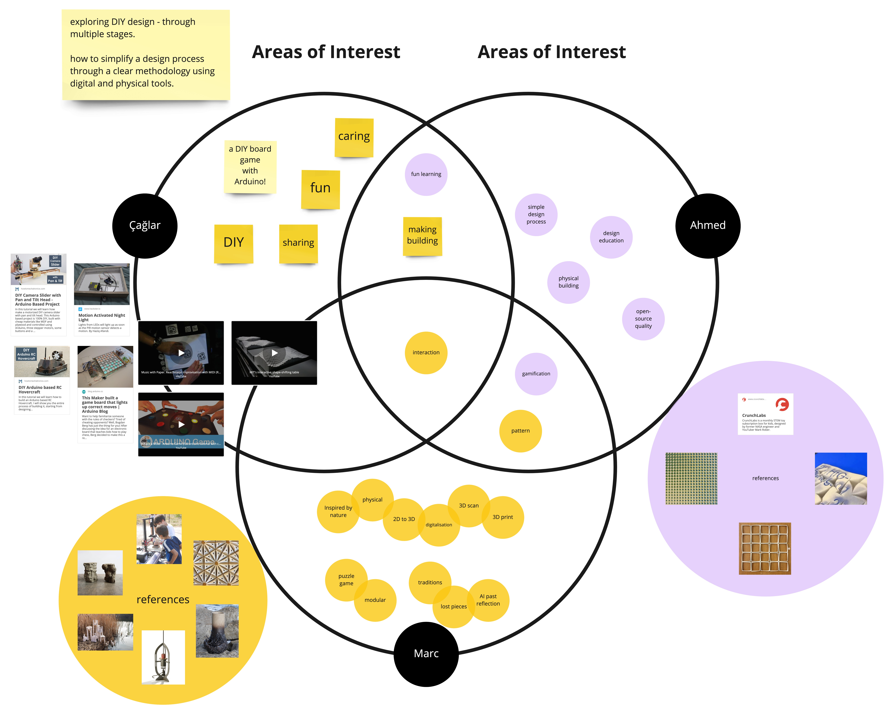
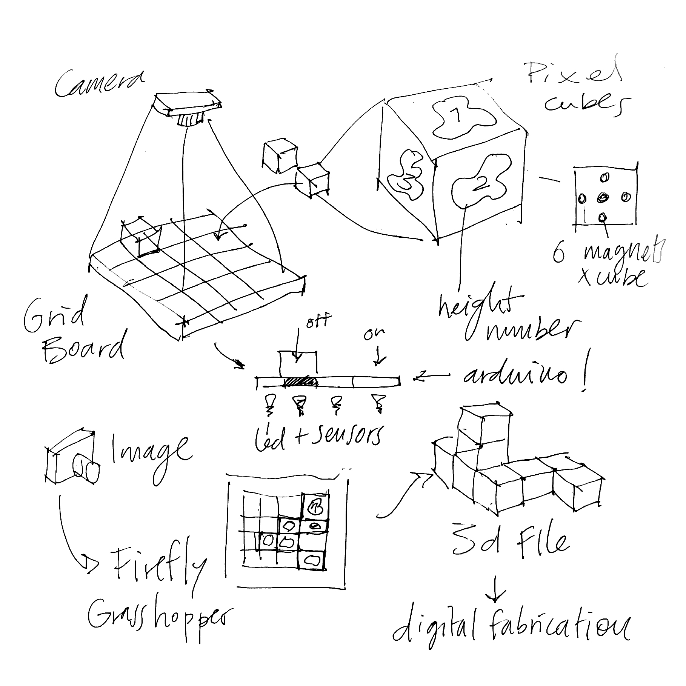
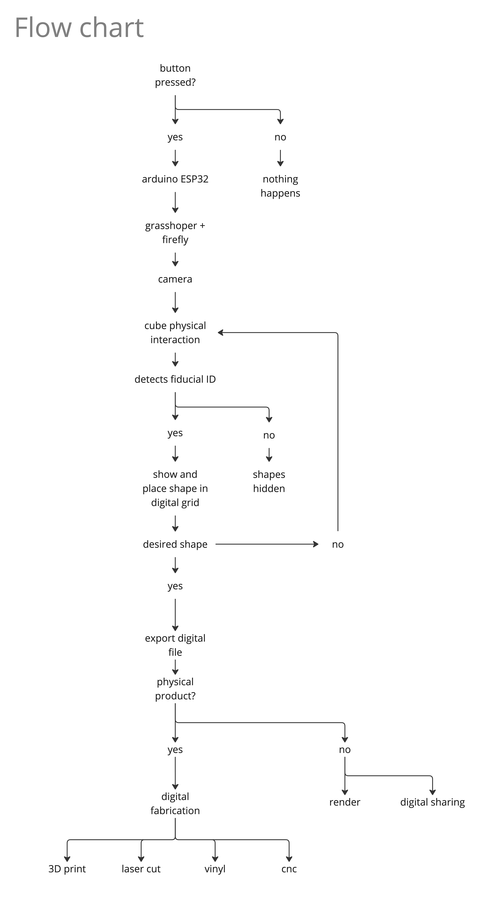
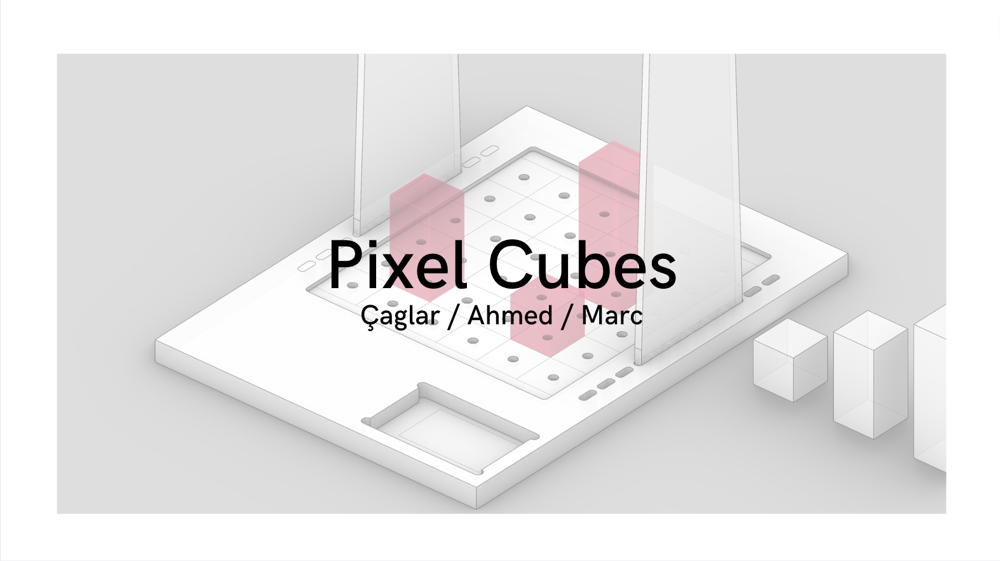

---
MDEF 22/23 - Pixel Cubes
---

###### `MDEF` `Fab Lab Barcelona`

Challenge II: Pixel Cubes
==========================================
Çaglar / Ahmed / Marc

**Modular system to create digital models through physical interaction.**

1. [**Project Alignment**](#1-Project-alignment)
2. [**Project Development**](#2-Project-development)
3. [**Final Product**](#3-Final-product)

## #1 Project Alignment

Interventions: Research Project

- Create digital models through physical interaction
- How to transform a difficult process into a game
- How to define a DIY Kit to allow everyone to create 3D models
- Create a process between physical and digital.

We decided to continue the [first Challenge](https://github.com/paresmarc/tiledeco) and develop iterations to improve it and make it a more automated process.

## #2 Project Development

**Design Steps:**
1. Interactive physical modular system to create myriad volumes (cubes)
2. Research around webcam detection software of movement and rotation of shapes (Fiducial ID, Firefly)
3. How to combine and assemble cubes in order to create volumes (magnets, polarity)
4. Make the user interact with the Software. Incorporate Arduino (button to restart)
5.

Artifact Description:

- Physical Interactive space with cubes like pixels.
- Recombine the locations of cubes to create myriad combinations.
- Each cube has a Reactable Fiducial ID on each face.
- A camera connected to Firefly, Grasshopper detect and know the location and height of each cube.
- Once the cubes have the desired shape, the camera scans them and generates a volume.
- With that, you can export a 3D file and reproduce it with digital fabrication machines.

*Flow Chart:*

**Challenge II Presentation**

[embed]https://paresmarc.github.io/pixelcubes/files/PixelCubes.pdf[/embed]

https://www.canva.com/design/DAFddcJntxw/8B6KbJQokXqWEhVzVGpUdw/edit

Introduction:

We had initially designed a tile decorating kit during Challenge I, which we decided to develop further. Our main goal was to focus on digitalization to make the kit more accessible and easier to use. Additionally, we wanted to upgrade the kit from 2D to 3D. Our aim was to use the project as a playground to explore 3D fabrication, which acts as a bridge between a physical object and its digital representation.

Research:

To assist with our project, we researched reference projects such as MIT's interactive shape-shifting table and Reactivision Improvisation with MIDI (Reactable). However, we had to simplify our goals due to time constraints.

Digitalization:

We began by focusing on the digitalization process. We researched and discovered a system called "fiducial id," which works through cameras and is similar to QR codes. However, fiducial IDs have more organic shapes. We used Grasshopper-Rhinoceros with a plug-in program called "Firefly" to capture the fiducial IDs. Each cube that was placed on the grid had a unique "Fiducial ID" that gave it a parameter on the Z axis to help form a unique 3D design.

We programmed the Grasshopper to detect the grid made of 6x6 slots to frame the design area and make the post-digitalization process easier. However, we faced problems when the camera detected the fiducials repeatedly, which created trash on the system. We solved this problem by resetting the system.

Physical Object:

We also worked on the physical object, which consisted of cubes made of wood. Initially, we had 3D printed the cubes, which were made of two parts and used six magnets. However, this method was not appropriate because it took three hours to print each cube. Therefore, we decided to build the cubes out of wood and insert the magnets on surfaces.

To ensure free availability while interacting with the cubes, we used sphere-shaped magnets that could move inside a cavity and position themselves in the precise polarity to connect with the magnet of the next cube. We designed a magnet insert for each magnet to solve that problem, and we 3D printed them with a SLA printer with resin.

However, we faced challenges when we tried to raster the fiducials on the cubes with a laser cutter. The camera did not detect them due to the low contrast with the wood grain. Therefore, we engraved the outlines and drew by hand at the end. We also had trouble cutting the cubes out of the oak block as the block was 33 mm thick. We used the RhinoCam-CNC and discovered the facing function, which provided the carving function with an end mill that had a 30mm diameter. However, we were losing a lot of material due to the space between pieces. Therefore, we decided to cut the cubes with the circular table saw.

We also used the CNC machine to build the grid out of plywood. We designed and laser-cut acrylic to build a structure to hold the camera above the grid. This structure was designed to be located in different positions on the grid to capture the cubes clearly.

Conclusion:

In conclusion, we successfully developed our tile decorating kit by focusing on digitalization and upgrading it to 3D. We faced challenges during the process, but we were able to solve them and develop a unique and innovative product. Our project is an excellent example of how technology can be used to enhance and improve traditional crafts.

## #3 Final Product

//fotos

* This project allowed us to improve the first Challenge, Tile Deco. With the Fiducial ID we are able to detect different types of shapes, the movement and rotation. Also, this system can digitalise and vectorize the shapes in an automatic process. This makes the design more straight forward and allow the user to center his attention on the design and see in live how the full pattern is looking in the digital.
